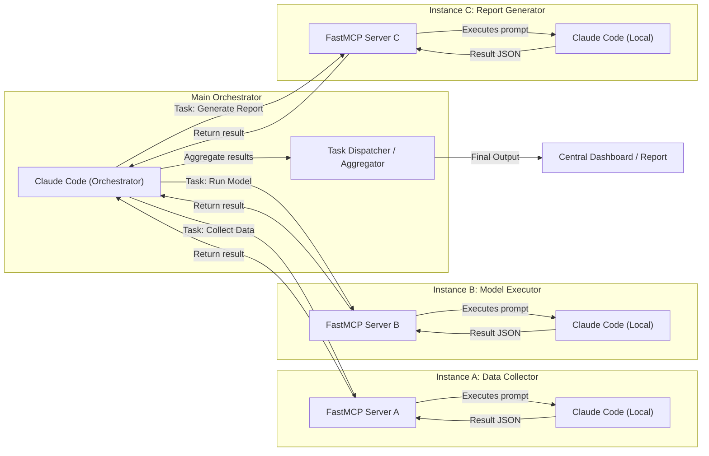
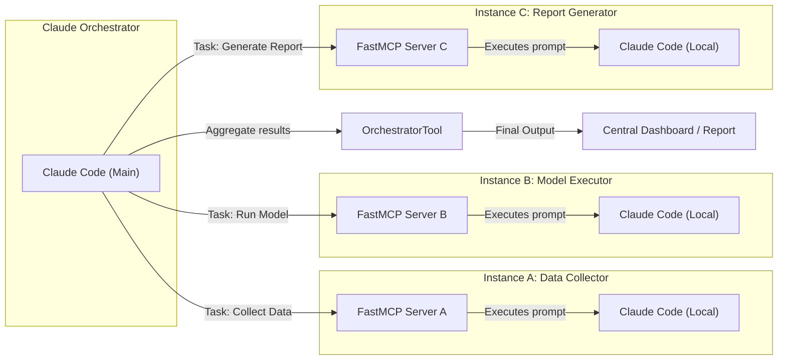

# claude-fast-mcp-server

```mermaid
flowchart LR

%% Main orchestration node
subgraph Orchestrator["Main Orchestrator"]
    direction TB
    ClaudeMain["Claude Code (Orchestrator)"]
    OrchestratorTool["Task Dispatcher / Aggregator"]
end

%% Worker Instances
subgraph InstanceA["Instance A: Data Collector"]
    direction TB
    MCP_A["FastMCP Server A"]
    ClaudeA["Claude Code (Local)"]
end

subgraph InstanceB["Instance B: Model Executor"]
    direction TB
    MCP_B["FastMCP Server B"]
    ClaudeB["Claude Code (Local)"]
end

subgraph InstanceC["Instance C: Report Generator"]
    direction TB
    MCP_C["FastMCP Server C"]
    ClaudeC["Claude Code (Local)"]
end

%% Communication Flow
ClaudeMain -->|Task: Collect Data| MCP_A
ClaudeMain -->|Task: Run Model| MCP_B
ClaudeMain -->|Task: Generate Report| MCP_C

MCP_A -->|Executes prompt| ClaudeA
MCP_B -->|Executes prompt| ClaudeB
MCP_C -->|Executes prompt| ClaudeC

ClaudeA -->|Result JSON| MCP_A
ClaudeB -->|Result JSON| MCP_B
ClaudeC -->|Result JSON| MCP_C

MCP_A -->|Return result| ClaudeMain
MCP_B -->|Return result| ClaudeMain
MCP_C -->|Return result| ClaudeMain

ClaudeMain -->|Aggregate results| OrchestratorTool
OrchestratorTool -->|Final Output| Dashboard["Central Dashboard / Report"]
```

```mermaid
flowchart LR

subgraph ClaudeMain["Claude Orchestrator"]
    CMain["Claude Code (Main)"]
end

%% Worker Instances
subgraph InstanceA["Instance A: Data Collector"]
    direction TB
    MCP_A["FastMCP Server A"]
    ClaudeA["Claude Code (Local)"]
end

subgraph InstanceB["Instance B: Model Executor"]
    direction TB
    MCP_B["FastMCP Server B"]
    ClaudeB["Claude Code (Local)"]
end

subgraph InstanceC["Instance C: Report Generator"]
    direction TB
    MCP_C["FastMCP Server C"]
    ClaudeC["Claude Code (Local)"]
end

CMain -->|Task: Collect Data| MCP_A
CMain -->|Task: Run Model| MCP_B
CMain -->|Task: Generate Report| MCP_C

MCP_A -->|Executes prompt| ClaudeA
MCP_B -->|Executes prompt| ClaudeB
MCP_C -->|Executes prompt| ClaudeC

CMain -->|Aggregate results| OrchestratorTool
OrchestratorTool -->|Final Output| Dashboard["Central Dashboard / Report"]

```